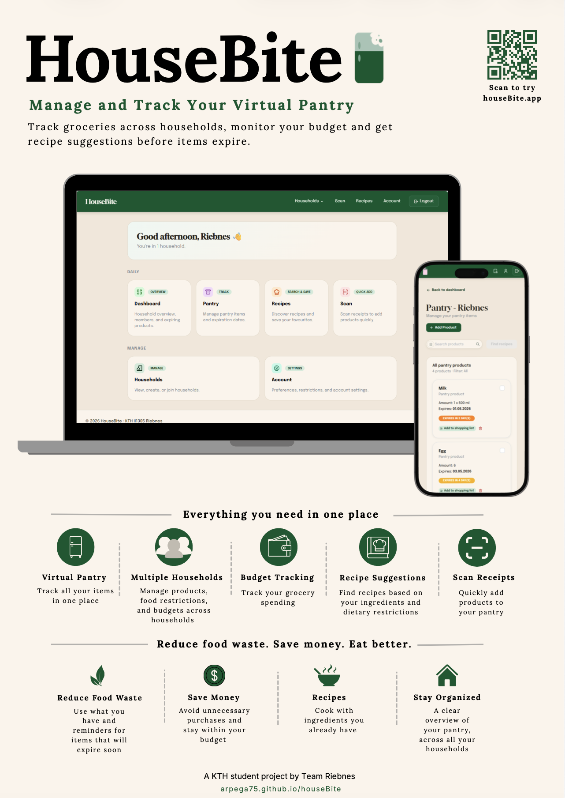

<div align="center">

# 🍽️ HouseBite

**Manage and Track Your Virtual Pantry**

[](https://housebite.app/)
[](https://arpega75.github.io/houseBite/)



*A KTH student project by Team Riebnes — Project in Information and Communication Technology (II1305)*

</div>

---

## Tech Stack

- **Frontend** — React 19, TypeScript, Vite, Mantine UI
- **Backend** — Supabase (PostgreSQL, Auth, Storage), Deno Edge Functions
- **APIs** — Spoonacular (recipes), custom OCR Edge Function (receipt scanning)

---

## Getting Started

**Prerequisites:** [Node.js LTS 24](https://nodejs.org/en/download), [Deno](https://deno.com/), [Docker Desktop](https://www.docker.com/products/docker-desktop/), [Supabase CLI](https://supabase.com/docs/guides/cli)

```bash
# Set up environment
cp web/.env.example web/.env

# Start local Supabase
supabase start

# Serve edge functions
supabase functions serve --env-file supabase/functions/.env &

# Start the app
docker compose up --build
```

App runs at **http://localhost:5173**

**Frontend only (no Docker):**

```bash
cd web && npm install && npm run dev
```
